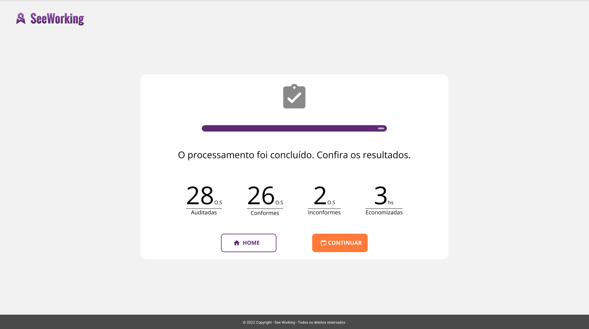

# processo-seletivo-2022.1
Bem-vindo ao exame técnico para o processo seletivo da Juridics.
Em primeiro lugar, agradecemos pelo seu interesse e sua disponibilidade em realizar mais esta etapa do processo seletivo.
Consideramos fundamental esta etapa do processo, pois permitirá que tanto você quanto a Juridics se conhecam um pouco melhor.

Desde já, salientamos que este exame irá medir o seu nível de "se virômetro", ou seja, o quanto é capaz de encontrar
soluções no dia a dia. Portanto, você está livre para pesquisar na Internet e até mesmo copiar códigos dos outros.
Porém, apresente um código final legível, entendível e organizado, pois isso será usado como critério de avaliação. Se tiver conhecimentos sobre clean code, utilize na sua solução.

Para realizar este exame, siga os seguintes procedimentos:
- Clone este repositório;
- Implemente cada questão na sua respectiva pasta;
- Faça um zip da pasta de repositório e envie para o email charles@juridics.com.

### Questão 1) Desenvolva em *html e css* a tela de exemplo
Crie a tela abaixo utilizando somente HTML e CSS. Faça o mais parecido possível com o desenho.


### Questão 2) Desenvolva uma função *em javascript* para retornar a sequência de Fibonacci
A sequência de Fibonacci é composta por uma sucessão de números descrita pelo matemático Leonardo de Pisa (1170-1250). Exemplo: ```0, 1, 1, 2, 3, 5, 8, 13, 21, 34, 55, 89, 144, 233```

A fórmula utilizada é:
```fn = fn - 1 + fn - 2```

Você deve criar uma função em js para receber como entrada a quantidade de números que deverá ser devolvido da sequência e devolver como saída a sequência em si. Exemplo: entrada 3 -> saída [0, 1, 1]; entrada 5 -> saída [0, 1, 1, 2, 3].

### Questão 3) Desenvolva *em python* endpoints REST para cadastro de investidor
Crie 4 endpoints que serão usados para cadastrar conta, debitar, creditar e saldo.

##### Cadastrar conta corrente
URL: POST /contas/
EXEMPLO ENTRADA: ```{ "banco": 1, "agencia": 1738, "conta": 10789 }```
EXEMPLO SAIDA: STATUS CODE 201 ```{ "id": 1}```

##### Crédito
URL: PUT /contas/<id>/credito
EXEMPLO ENTRADA: ```{ "valor": 10.75 }```
EXEMPLO SAIDA: STATUS CODE 200

##### Débito
URL: PUT /contas/<id>/debito
EXEMPLO ENTRADA: ```{ "valor": 9.75 }```
EXEMPLO SAIDA: STATUS CODE 200

##### Saldo
URL: GET /contas/<id>/saldo
EXEMPLO SAIDA: STATUS CODE 200 ```{ "valor": 1.0}```
  
Atenção aos pontos abaixo: 
 - É permitido utilizar frameworks python, tais como: Flask, Django, Fast e outros;
 - Não deve ser utilizado banco de dados (relacional ou NoSQL), mas os dados devem ser mantidos na memória;
  
Atenção: crie o arquivo requirements.txt para registrar que usou libs.
